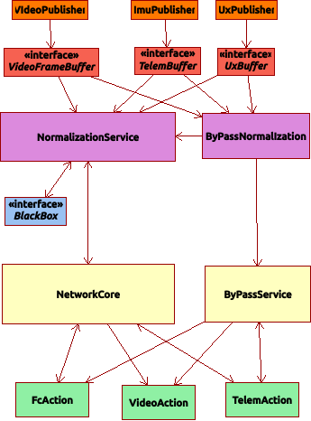

# rr_quadx_ws

ROS2 workspace for Ryder Robot QuadX drone


## Overview 



## Initial Setup

### Step 1 Preparing SD Card


Using Raspberry Pi Imager,  set the following:

| Option              | Value                             | Description                               |
|---------------------|-----------------------------------|-------------------------------------------|
| Raspberry Pi Device | RASPBERRY PI 5                    | Device that image will be installed on    |
| Operating System.   | UBUNTU SERVER 24.04.3 LTS (64bit) | Operating System on PI                    |
| Storage             | (See select)                      | Assigned reference of SD card on local OS |

### Step 2 Setup Network

After SD card is added to Raspberry Pi, set up a bridging network to perform next steps. Plug ethernet cable
into Pi and connect to local host computer. **Note that on Pi a reboot may be required before logging in works**.

Assuming that host computer is a mac go to 
* Apple Menu > System Settings > General > Sharing.
* Select Internet Sharing 
* Enable Internet Sharing by checking the box. Confirm when prompted.

Once logging into the Pi run the following commands:

```bash
# Get address of PI
ip a

# eth0 will be the address given by ip a command
sudo dhcpd eth0

# Test connection with a ping
ping 8.8.8.8
```
### Step 3 Update apt

On Pi

```bash
sudo apt update && sudo apt upgrade -y
```

Apply WiFi network setting

```bash
sudo netplan apply
```

### Step 4 Install Git

```bash
sudo apt install git -y
```

### Step 5 Create libcamera

```bash
sudo apt install -y build-essential  ninja-build meson software-properties-common cmake glib-2.0 doxygen graphviz python3-sphinx python3-sphinxcontrib.doxylink python3-pip
sudo apt install -y libcamera-dev libepoxy-dev libjpeg-dev libtiff5-dev libpng-dev qtbase5-dev libavcodec-dev libavdevice-dev libavformat-dev libswresample-dev libboost-program-options-dev libdrm-dev libexif-dev python3-ply qt6-base-dev libevent-dev v4l-utils
sudo apt install -y \
  libgstreamer1.0-dev \
  libgstreamer-plugins-base1.0-dev \
  libgstreamer-plugins-bad1.0-dev \
  gstreamer1.0-plugins-base \
  gstreamer1.0-plugins-good \
  gstreamer1.0-plugins-bad \
  gstreamer1.0-plugins-ugly \
  gstreamer1.0-libav \
  gstreamer1.0-tools \
  gstreamer1.0-x \
  gstreamer1.0-alsa \
  gstreamer1.0-gl \
  gstreamer1.0-gtk3 \
  gstreamer1.0-pulseaudio
mkdir -p system_ws && cd system_ws
git clone https://github.com/raspberrypi/libcamera.git
git clone https://github.com/raspberrypi/rpicam-apps.git

cd ${HOME}/system_ws/libcamera
meson setup build --buildtype=release \
    -Dpipelines=rpi/vc4,rpi/pisp \
    -Dipas=rpi/vc4,rpi/pisp \
    -Dv4l2=enabled \
    -Dgstreamer=enabled \
    -Dtest=true \
    -Dlc-compliance=enabled \
    -Dcam=disabled \
    -Dqcam=enabled \
    -Ddocumentation=disabled \
    -Dpycamera=disabled 
sudo ninja -C build install

cd ${HOME}/system_ws/rpicam-apps
meson setup build --buildtype=release
sudo meson install -C build 
sudo ldconfig
```

### Step 6 setup camera
*NOTE tested on Pi 5*
Check the camera module, this should be on the back of the packet, for example Camera Module 3 is IMX708


On operating system open and edit file ```/boot/firmware/config.txt``` the following options will need to be modified:

```bash
modify camera_auto_detect=0
add dtoverlay=imx708,cam1 to "[all]" 
```

dtoverlay is set to the model number of the camera, and the port is based on which port it is plugged into the pi5, this will either be
cam0, or cam1.  For this example it is cam1 which is the following port:


After this libcamera, and rpicam-apps can compile,  note that this is included in ros2_setup.bash script. Reboot the pi

```bash
sudo usermod -aG video ${USER}
sudo reboot
```

#### Test for cameras

##### Raspberry Pi 

```bash
rpicamera-hello --list-cameras
sudo rpicam-vid -t 0 -n --codec libav --libav-format mpegts -o udp://192.168.1.15:5600
```

##### Host Side

```bash
ffplay udp://192.168.1.12:5600 -fflags nobuffer -flags low_delay -framedrop
```


### Step 7 Setup ROS2

Assuming that valid SSH id_rsa has been created on Pi '${HOME}/.ssh' directory

```bash
git clone git@github.com:Ryder-Robots/rr_quadx_ws.git
cd rr_quadx_ws
./scripts/ros2_setup.bash
```

## Package Layout

Development for ROS2 is performed using the following build tool colcon,  documenation can be found at [A universal build tool](https://design.ros2.org/articles/build_tool.html)

Packages for ROS2 are defined via REP149,  documentation found at [Package Manifest Format Three Specification](https://www.ros.org/reps/rep-0149.html)